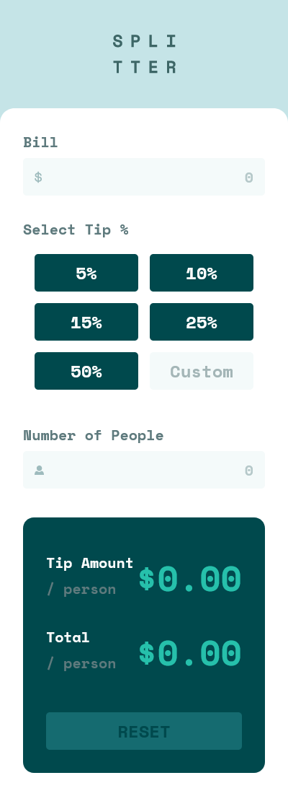

# Frontend Mentor - Tip calculator app solution

This is a solution to the [Tip calculator app challenge on Frontend Mentor](https://www.frontendmentor.io/challenges/tip-calculator-app-ugJNGbJUX). Frontend Mentor challenges help you improve your coding skills by building realistic projects.

## Table of contents

- [Overview](#overview)
  - [The challenge](#the-challenge)
  - [Screenshot](#screenshot)
  - [Links](#links)
- [My process](#my-process)
  - [Built with](#built-with)
  - [What I learned](#what-i-learned)
  - [Continued development](#continued-development)
  - [Useful resources](#useful-resources)
- [Author](#author)

## Overview

### The challenge

Users should be able to:

- View the optimal layout for the app depending on their device's screen size
- See hover states for all interactive elements on the page
- Calculate the correct tip and total cost of the bill per person

### Screenshot




### Links

- Solution URL: [Solution](https://github.com/fidellim/Tip-Calculator-FEM)
- Live Site URL: [Live Site](https://fidellim-tip-calculator-fem.netlify.app/)

## My process

### Built with

- Semantic HTML5 markup
- SCSS
- Flexbox
- CSS Grid
- Mobile-first workflow
- Progressive Web App (PWA)
- [React](https://reactjs.org/) - JS library

### What I learned

Practiced applying multiple ternary operators. Also, I was able to build my first PWA.

```js
className = {type === 'tip' && isToggled ?
                        `${type} selected` :
                        type === 'tip' && !isToggled ?
                        'tip' : `reset ${type}`}
```

Command used to create a react app with service worker files

```cmd
npx create-react-app your-app-name --template cra-template-pwa
```

### Continued development

To be able to create more Progressive Web Apps. Then, to be comfortable at making apps using React.

### Useful resources

- [Remaining files for PWA](https://dev.to/myfatemi04/turn-your-create-react-app-into-a-progressive-web-app-in-100-seconds-3c11) - This will help you create your first PWA using React. If you have created React using this command "npx create-react-app my-app", then this reference will guide you to include the remaining files needed.

- [Create PWA](https://www.youtube.com/watch?v=WbbAPfDVqfY) - This will help you understand briefly what PWA is. Also, it will teach you on how to make your app into a PWA

- [React app to PWA](https://www.youtube.com/watch?v=MMXKjrBWgPo) - If you are using React as your framework for your app, you can use this link to watch on how to convert your app to a PWA.

## Author

- Website - [Fidel Lim](https://fidellim-portfolio.netlify.app/)
- Frontend Mentor - [@fidellim](https://www.frontendmentor.io/profile/fidellim)
- Github - [@fidellim](https://github.com/fidellim)
